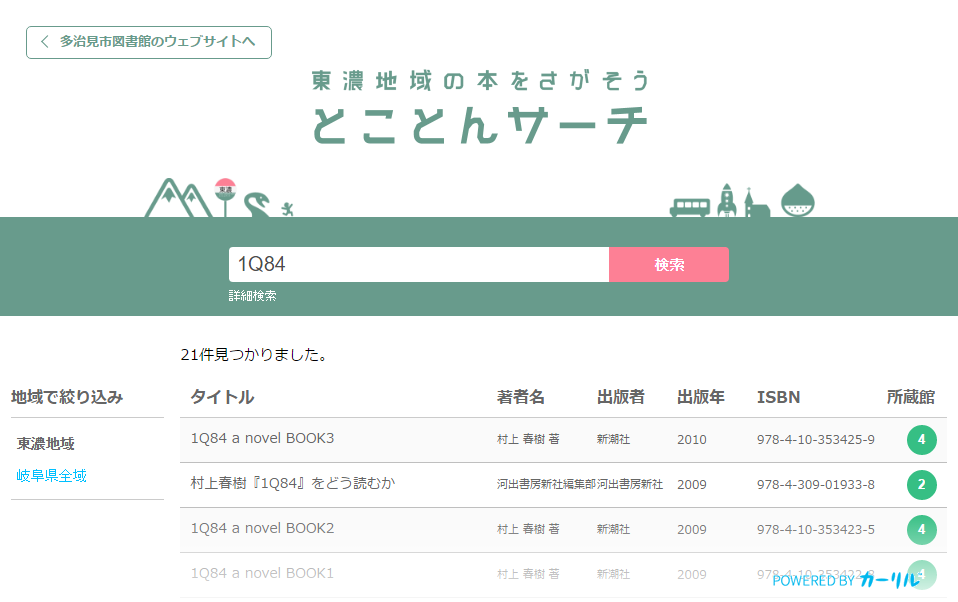

# Unitrad UI [](https://circleci.com/gh/CALIL/unitrad-view) [](https://codeclimate.com/repos/57dbd79e63c7b449d2002209/feed)

Reactで構築された蔵書検索のための汎用的なユーザーインターフェース。



## 主な特徴

- シンプルで実用的なユーザーインターフェース
- ソートやフィルタのクライアントサイド実装
- 検索結果へのパーマリンク対応

## ビルド

```bash
npm update
gulp release
```

## ロードマップ

- ウェブアクセシビリティ対応（ほぼ完了）
- セカンダリリージョン
- ドキュメントの充実
- Unitrad API以外への対応（OpenSearchなど）

## 採用例

- [京都府図書館総合目録ネットワーク](https://www.library.pref.kyoto.jp/cross/cross.html)
- [県立長野図書館「信州ブックサーチ」](https://www.library.pref.nagano.jp/licsxp-opac/shinshubooksearch.html)
- [とことんサーチ（岐阜県東濃地域）](https://tokoton.calil.jp/)
- [さばサーチ（福井県丹南地域）](https://sabae.calil.jp/)

